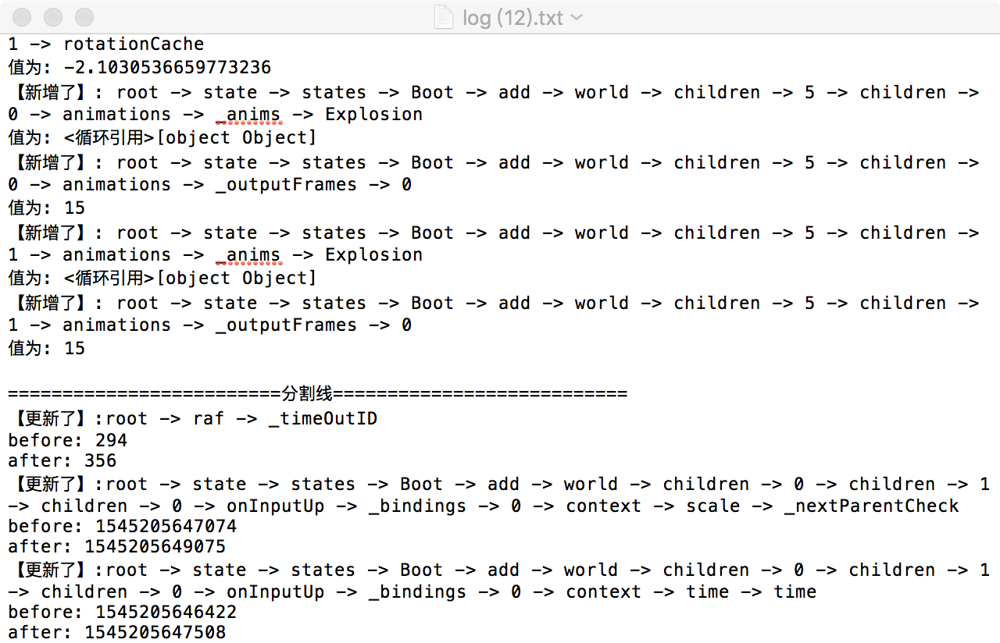

# compare-tree

> v2.0

## 功能

输入两棵对象树, 输出第二课对象树基于第一棵对象树所发生的改变: 增加情况，删除情况，更新情况

## 使用

1 引入`dist/compare.js`

2 找到动画循环中的 `rq`函数, 再找出存储状态的数据对象（如`e.Game`）, 挂载到`window`上, 传入调用函数`compareTree.init(window.Game)`

3 在调试游戏过程中, 遇到关键的帧, 点击面板中的`创建快照按钮`

4 每累计点击两次, 自动下载这两次的 `对比结果.txt`

## 说明

1 只在开发环节使用

2 加入`webpack`构建, 用es6语法

## 思路概要

## 效果图

