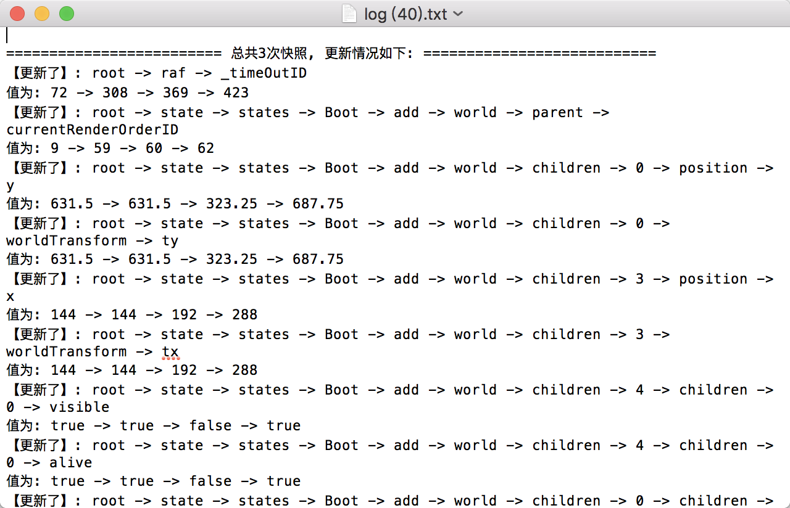
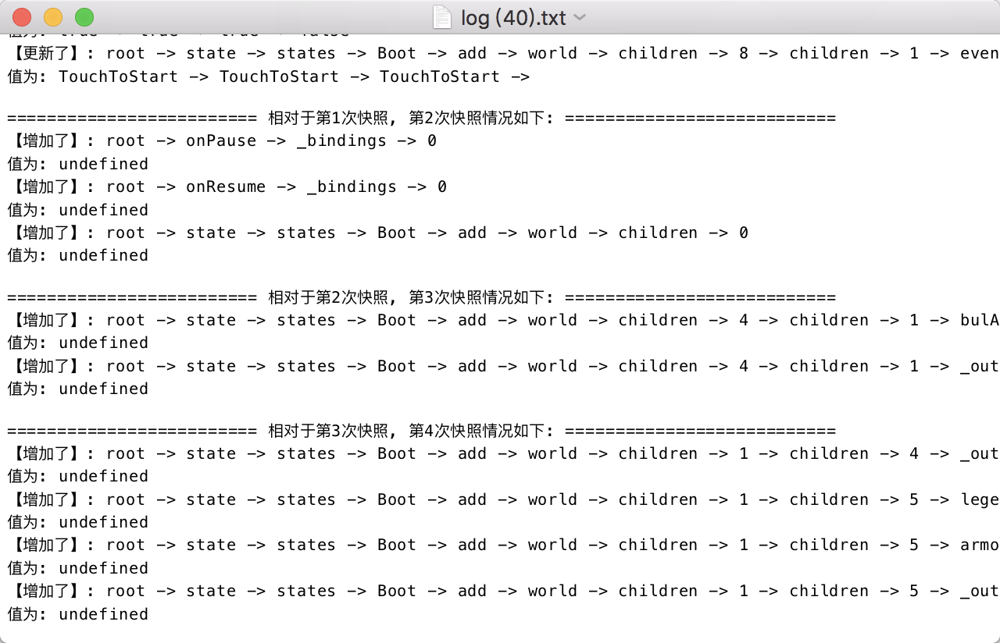

# compare-tree

> v3.0

## 功能

1 在游戏过程中, 可以不断创建快照

2 点击导出, 可导出txt文件, 清晰地看出几次快照中, 对象树中属性新增，删除以及更新的情况

## 使用

1 引入`dist/compare.js`

2 找到动画循环中的 `rq`函数, 再找出存储状态的数据对象（如`e.Game`）, 挂载到`window`上, 传入调用函数`compareTree.init(window.Game)`

3 在调试游戏过程中, 遇到关键的帧, 点击面板中的`创建快照按钮`

4 点击`导出报表`查看`txt文件`

## 说明

1 (V) 只在开发环节使用

2 (V) 加入`webpack`构建, 用es6语法

3 (X) 相对于`v2.0`版本, 深拷贝时能兼容es6的`Set, Map, WeakSet, WeakMap`

4 (V) 相对于`v2.0`版本, 能更连贯地看出一个属性值的变化情况

5 (X) 相对于`v2.0`版本, 增加了测试用例

## 思路概要

## 效果图

